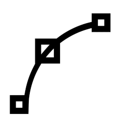
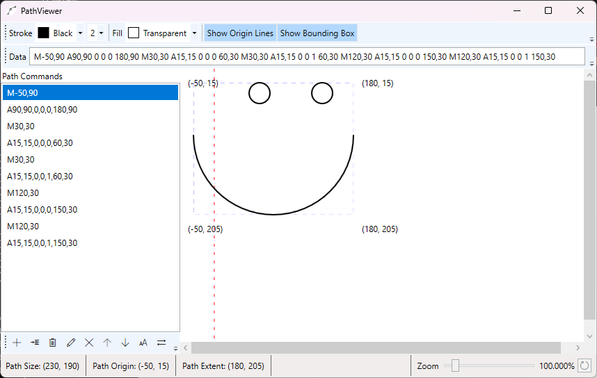

<div style="background-color: #4A90E2; padding: 5px 10px;">
  <h1 style="color: white; margin: 5px 0;">PathViewer</h1>
  <div align="center">
    
  </div>
</div>

PathViewer is a powerful WPF application for visualizing, editing, and manipulating SVG path data. It provides real-time rendering of path commands with an intuitive interface for both learning and working with complex path geometries.

> **Note:** This project is based on the original [PathViewer by ignaciosp82](https://github.com/ignaciosp82/PathViewer) with additional features and enhancements.

## Screenshot



## Features

### Path Visualization
- **Real-time rendering** - Path updates instantly as you type
- **Interactive path segments** - Click on any drawn path segment to select it in the list
- **Visual highlighting** - Selected segments are highlighted in orange for easy identification
- **Clickable segments** - Each path command is individually selectable and interactive

### Path Editing
- **Live text editor** - Direct path data editing with real-time validation
- **Command list** - All path commands displayed in an organized list
- **Add/Insert/Edit/Delete** - Full CRUD operations on individual commands
- **Reorder commands** - Move commands up and down in the sequence
- **Command properties** - Edit individual command parameters through dedicated dialogs

### Visualization Controls
- **Stroke customization** - Choose from all WPF named colors and adjustable thickness (1-20px)
- **Fill color** - Full color palette support for filled shapes
- **Zoom** - Scale from 1% to 800% with reset button
- **Origin lines** - Toggle display of X/Y axis lines at (0,0)
- **Bounding box** - Show the path's bounding rectangle with corner coordinates
- **Viewport information** - Real-time display of path size, origin, and extent

### Path Operations
- **Scale Path** - Resize the entire path proportionally or independently on X/Y axes
- **Move Path** - Translate the entire path by specified X/Y offsets
- **Clear All** - Remove all commands and start fresh

### Status Information
- **Path Size** - Width and height of the bounding box
- **Path Origin** - Top-left corner coordinates
- **Path Extent** - Bottom-right corner coordinates
- **Error Reporting** - Clear error messages when path syntax is invalid

## Supported Path Commands

PathViewer fully supports all SVG path commands:

- **M/m** - Move (absolute/relative)
- **L/l** - Line (absolute/relative)
- **H/h** - Horizontal Line (absolute/relative)
- **V/v** - Vertical Line (absolute/relative)
- **C/c** - Cubic Bézier Curve (absolute/relative)
- **S/s** - Smooth Cubic Bézier Curve (absolute/relative)
- **Q/q** - Quadratic Bézier Curve (absolute/relative)
- **T/t** - Smooth Quadratic Bézier Curve (absolute/relative)
- **A/a** - Elliptical Arc (absolute/relative)
- **Z/z** - Close Path

## Usage

### Basic Workflow

1. **Enter Path Data** - Type or paste SVG path data in the "Data" text box
2. **View Rendering** - The path renders automatically in the main viewport
3. **Adjust Appearance** - Use toolbar controls to change colors, thickness, and visibility options
4. **Edit Commands** - Select commands from the list to edit, reorder, or delete them
5. **Interactive Selection** - Click directly on the drawn path to select that segment

### Keyboard Shortcuts

- Click on path segments in the viewport to select them
- Use mouse wheel over zoom slider for precise control

### Example Path Data

```
M-50,90 A90,90 0 0 0 180,90 M30,30 A15,15 0 0 0 60,30 M30,30 A15,15 0 0 1 60,30 M120,30 A15,15 0 0 0 150,30 M120,30 A15,15 0 0 1 150,30
```

## Technical Details

### Technology Stack
- **.NET 9.0**
- **WPF (Windows Presentation Foundation)** - UI framework
- **CommunityToolkit.Mvvm** - MVVM pattern implementation
- **C# 12** - Modern C# features

### Architecture
- **MVVM Pattern** - Clean separation of concerns
- **Observable Collections** - Automatic UI updates
- **Command Pattern** - All user actions as commands
- **Custom Path Command Classes** - Strongly-typed representation of each SVG command type
- **Real-time Parsing** - Regex-based path data parser with error handling

### Project Structure
```
PathViewer/
├── MainWindow.xaml/cs         # Main application window
├── PathViewModel.cs           # Main view model with path logic
├── PathSegmentViewModel.cs    # Individual segment rendering data
├── AddOrEdit.xaml/cs          # Command editor dialog
├── AddViewModel.cs            # Add/Edit command view model
├── ScaleOrMove.xaml/cs        # Scale/Move transformation dialog
├── ScaleOrMoveViewModel.cs    # Scale/Move view model
├── PathCommands/              # Path command implementations
│   ├── PathCommand.cs         # Base class for all commands
│   ├── Move.cs
│   ├── Line.cs
│   ├── HorizontalLine.cs
│   ├── VerticalLine.cs
│   ├── CubicBezier.cs
│   ├── SmoothCubicBezier.cs
│   ├── QuadraticBezier.cs
│   ├── SmoothQuadraticBezier.cs
│   ├── EllipticalArc.cs
│   └── Close.cs
├── ViewModelBase.cs           # Base view model class
├── PopupBase.cs               # Base class for dialogs
├── ValueConverter.cs          # XAML value converters
└── ItemType.cs                # Command type enumeration
```

## Requirements

- Windows 10/11 (version 22621 or higher)
- .NET 9.0 Runtime

## Building from Source

```bash
git clone https://github.com/ignaciosp82/PathViewer.git
cd PathViewer
dotnet build PathViewer.sln
dotnet run --project PathViewer/PathViewer.csproj
```

## Acknowledgments

This project is based on the original [PathViewer](https://github.com/ignaciosp82/PathViewer) by [ignaciosp82](https://github.com/ignaciosp82). Thank you for creating the foundation that made this enhanced version possible!

## License

See [LICENSE](LICENSE) file for details.

## Contributing

Contributions are welcome! Feel free to submit issues and pull requests.

## Use Cases

- **Learning SVG Paths** - Visualize how path commands work
- **Path Development** - Create and test path data for web or graphics projects
- **Path Debugging** - Identify issues in complex path definitions
- **Icon Design** - Create simple vector icons using path data
- **Educational Tool** - Teach vector graphics and path concepts
